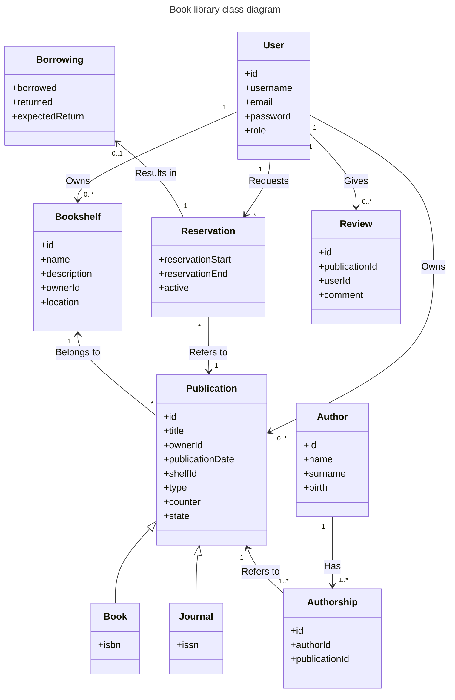

# Class Diagram

```mermaid
---
title: Book library class diagram
---
classDiagram
    Publication <|-- Book
    Publication <|-- Journal
    User "1" --> "0..*" Publication : Owns
    User "1" --> "*" Reservation : Requests
    User "1" --> "0..*" Bookshelf : Owns
    User "1" --> "0..*" Review : Gives 
    Reservation "*" --> "1" Publication : Refers to
    Borrowing "0..1" <-- "1" Reservation : Results in
    Bookshelf "1" <-- "*" Publication : Belongs to
    Author "1" --> "1..*" Authorship : Has
    Publication "1" <-- "1..*" Authorship : Refers to

    class Publication {
        +id
        +title
        +ownerId
        +publicationDate
        +shelfId
        +type
        +counter
        +state
    }

    class Book {
        +isbn
    }

    class Journal {
        +issn
    }

    class User {
        +id
        +username
        +email
        +password
        +role
    }

    class Borrowing {
        +borrowed
        +returned
        +expectedReturn
    }

    class Reservation {
        +reservationStart
        +reservationEnd
        +active
    }

    class Bookshelf {
        +id
        +name
        +description
        +ownerId
        +location
    }

    class Review {
        +id
        +publicationId
        +userId
        +comment
    }

    class Author {
        +id
        +name
        +surname
        +birth
    }

    class Authorship{
        +id
        +authorId
        +publicationId
    }
```
