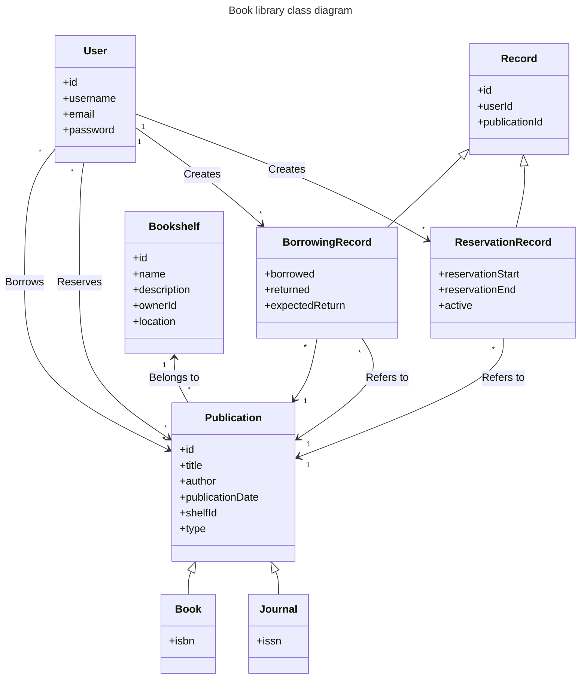

# Class Diagram

```mermaid
---
title: Book library class diagram
---
classDiagram
    Publication <|-- Book
    Publication <|-- Journal
    Record <|-- BorrowingRecord
    Record <|-- ReservationRecord
    User "*" --> "*" Publication : Borrows
    User "*" --> "*" Publication : Reserves
    BorrowingRecord "*" --> "1" Publication
    User "1" --> "*" BorrowingRecord : Creates
    User "1" --> "*" ReservationRecord : Creates
    ReservationRecord "*" --> "1" Publication : Refers to
    BorrowingRecord "*" --> "1" Publication : Refers to
    Bookshelf "1" <-- "*" Publication : Belongs to

    class Publication {
        +id
        +title
        +author
        +publicationDate
        +shelfId
        +type
    }

    class Book {
        +isbn
    }

    class Journal {
        +issn
    }

    class User {
        +id
        +username
        +email
        +password
    }

    class Record {
        +id
        +userId
        +publicationId
    }

    class BorrowingRecord {
        +borrowed
        +returned
        +expectedReturn
    }

    class ReservationRecord {
        +reservationStart
        +reservationEnd
        +active
    }

    class Bookshelf {
        +id
        +name
        +description
        +ownerId
        +location
    }
```
